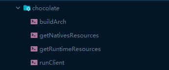

# Chocolate Gradle

This is a gradle plugin for Chocolate Client Development.

# Review


# Usage

In your build.gradle file (below with kotlin)

1. add buildscript 
2. add jitpack repo and dependencies
3. apply plugin

```groovy
buildscript{
    repositories{
        maven { url = uri("https://www.jitpack.io") }
    }
    dependencies {
        classpath("com.github.howxu:chocolate_gradle:v1.4")
    }
}

apply(plugin = "chocolate_gradle")
```

**Gradle command please check [Chocolate](https://github.com/HowXu/Chocolate)**